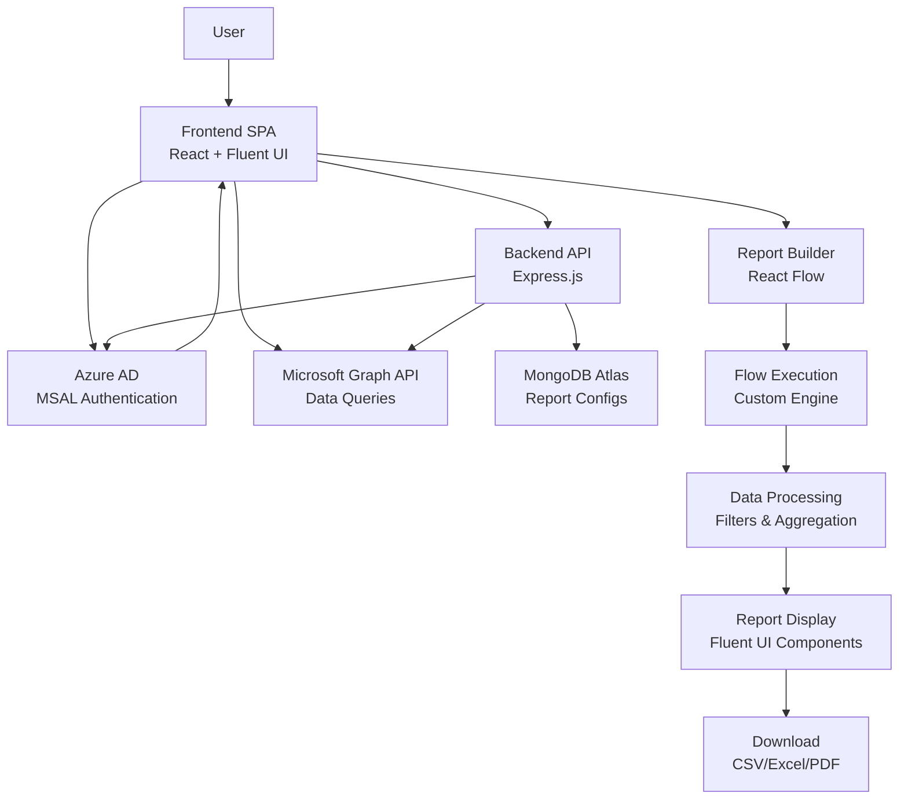

# M365 Agent Web Application Architecture Plan

## Overview
This document outlines the technical architecture and specifications for a web application that provides organizational login via Microsoft Azure AD, integrates with Microsoft 365 through Microsoft Graph, features a UI similar to M365 admin centers, and includes a drag-and-drop report builder for creating customizable reports with filters and download functionality. All selected components are free or free-tier to minimize costs.

## Tech Stack

### Frontend
- **Framework**: React 18 with TypeScript
- **Routing**: React Router
- **State Management**: Redux Toolkit (for complex state) or React Context (for simpler state)
- **Build Tool**: Vite (fast development and build)
- **Styling**: Fluent UI (@fluentui/react) - Microsoft's design system for consistent M365-like UI

### Backend
- **Runtime**: Node.js 18+
- **Framework**: Express.js (minimal API server for proxying Graph requests and handling sensitive operations)
- **Authentication**: MSAL Node (@azure/msal-node) for server-side token handling
- **API**: RESTful APIs for report configuration storage and execution

### Database
- **Database**: MongoDB Atlas (free tier: 512MB storage)
- **ODM**: Mongoose (for schema definition and data validation)
- **Purpose**: Store user report configurations, saved reports, and user preferences

### Authentication & Authorization
- **Provider**: Microsoft Azure AD (free tier available)
- **Library**: MSAL for JavaScript (@azure/msal-browser for frontend, @azure/msal-node for backend)
- **Scopes**: User.Read, Directory.Read.All, Reports.Read.All (depending on required permissions)
- **Flow**: Authorization Code Flow with PKCE for SPA security

### UI Framework
- **Library**: Fluent UI (@fluentui/react)
- **Theme**: Default Fluent theme with customizations to match M365 admin center aesthetics
- **Components**: CommandBar, Nav, DetailsList, Panels, etc.

### Report Builder
- **Library**: React Flow (reactflow.dev) - open-source library for building node-based UIs
- **Custom Nodes**:
  - Data Source Node: Select Microsoft Graph endpoints (users, groups, mail, etc.)
  - Filter Node: Apply filters (date ranges, user properties, etc.)
  - Aggregate Node: Sum, count, average operations
  - Transform Node: Data manipulation (sort, group, etc.)
  - Output Node: Define report format (table, chart)
- **Execution Engine**: Custom JavaScript engine to traverse the flow and execute Graph API calls

### Report Generation & Download
- **Data Processing**: JavaScript-based execution of report flows
- **Filtering**: Runtime filters using Fluent UI components (Dropdown, DatePicker, TextField)
- **Visualization**: Fluent UI DetailsList for tabular data, Chart.js or Recharts for charts
- **Download Libraries**:
  - CSV: PapaParse
  - Excel: ExcelJS
  - PDF: jsPDF with autoTable plugin
- **Formats**: CSV, Excel (.xlsx), PDF

### APIs & Services
- **Microsoft Graph API**: Primary data source for M365 data
  - Endpoints: /users, /groups, /reports, /mail, /calendar, etc.
  - SDK: @microsoft/microsoft-graph-client
- **Azure AD**: Authentication and user management
- **MongoDB Atlas**: Data persistence

### Deployment Platform
- **Frontend**: Vercel (free tier: unlimited static sites, serverless functions)
- **Backend**: Heroku (free tier: 512MB RAM, 1 web dyno) or Vercel serverless functions
- **Database**: MongoDB Atlas (free tier)
- **CI/CD**: GitHub Actions (free for public repos) or Vercel/Heroku built-in

## Architecture Diagram

## Authentication Flow
1. User accesses the application
2. Frontend initializes MSAL and redirects to Azure AD login
3. User authenticates with organizational credentials
4. Azure AD redirects back with authorization code
5. Frontend exchanges code for access token
6. Token stored securely in memory/session storage
7. Subsequent Graph API calls include the access token
8. Backend (if used) validates tokens and proxies sensitive requests

## Security Considerations
- Use HTTPS for all communications
- Store sensitive data (client secrets) as environment variables
- Implement token refresh logic
- Validate user permissions before accessing Graph data
- Use CORS policies to restrict API access
- Implement rate limiting on API endpoints
- Regular security audits and dependency updates

## Development & Deployment Strategy
- **Version Control**: Git with GitHub
- **Development Environment**: Local development with hot reload
- **Testing**: Jest for unit tests, React Testing Library for component tests
- **CI/CD**: Automated deployment on push to main branch
- **Monitoring**: Vercel/Heroku built-in monitoring, error logging with Winston
- **Scalability**: Serverless architecture allows automatic scaling
- **Backup**: MongoDB Atlas automated backups (limited in free tier)

## Implementation Phases
1. **Phase 1**: Setup project structure, authentication, basic UI
2. **Phase 2**: Implement Microsoft Graph integration
3. **Phase 3**: Build report builder with React Flow
4. **Phase 4**: Implement report execution and download functionality
5. **Phase 5**: Testing, optimization, and deployment

## Potential Challenges & Mitigations
- **Graph API Rate Limits**: Implement caching and batch requests
- **Complex Report Logic**: Start with simple flows, gradually add complexity
- **UI Responsiveness**: Use Fluent UI responsive components
- **Data Privacy**: Ensure compliance with GDPR and organizational policies
- **Browser Compatibility**: Test on supported browsers (Chrome, Edge, Firefox, Safari)

## Cost Estimation (Free Tier)
- **Frontend Hosting**: $0 (Vercel free tier)
- **Backend Hosting**: $0 (Heroku free tier or Vercel functions)
- **Database**: $0 (MongoDB Atlas free tier)
- **Azure AD**: $0 (Free tier for development)
- **All Libraries**: $0 (Open source)
- **Total**: $0 for development and small-scale production

## Next Steps
1. Set up Azure AD application registration
2. Initialize React project with selected stack
3. Implement authentication flow
4. Create basic UI layout mimicking M365 admin centers
5. Integrate Microsoft Graph client
6. Develop report builder interface
7. Implement flow execution logic
8. Add download functionality
9. Deploy to chosen platforms
10. Conduct user testing and iterate